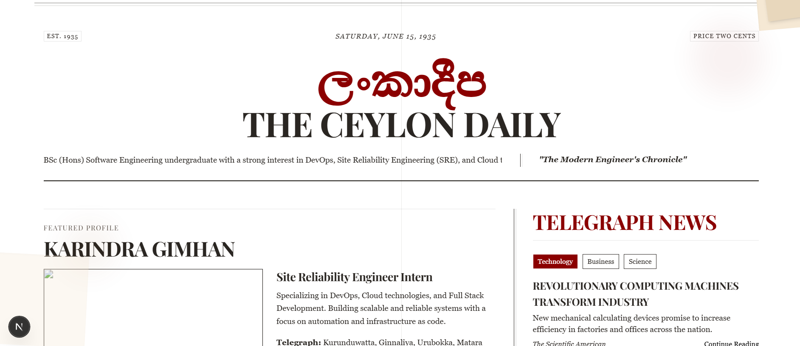

# 📰 Sinhala Newspaper Portfolio

This is a portfolio website styled like a Sinhala newspaper 🗞️, built using **Next.js** and **Tailwind CSS**, and powered by the **NewsAPI** for dynamic news content. The design reflects the traditional feel of a newspaper while presenting portfolio content creatively.



## 🛠️ Tech Stack

- [Next.js](https://nextjs.org/)
- [Tailwind CSS](https://tailwindcss.com/)
- [NewsAPI](https://newsapi.org/)
- Responsive Design (Mobile-first)
- Deployed on [Vercel](https://vercel.com/) or your preferred hosting provider

## 📸 Screenshot

> 

## 🚀 Features

- 📢 Dynamic news section using NewsAPI
- 🎨 Newspaper-style layout with custom Tailwind styling
- 🧑‍💼 Portfolio sections for personal info, projects, and contact
- 🌐 Fully responsive and mobile-friendly

## 🔧 Setup Instructions

1. **Clone the Repository**
   ```bash
   git clone https://github.com/yourusername/sinhala-newspaper-portfolio.git
   cd sinhala-newspaper-portfolio

